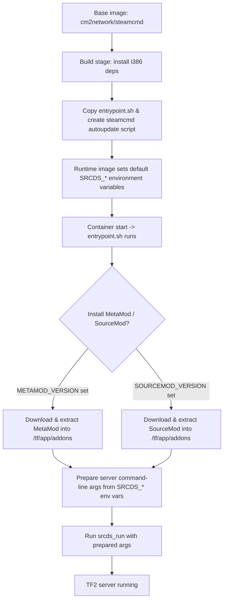

# TF2Image (UDL)

Official Team Fortress 2 server image for UDL. Heavily inspired by the [CM2Walki/TF2](https://github.com/CM2Walki/TF2) project and adapted to UDL's needs and defaults.

This image provides a reproducible container for running a TF2 dedicated server with optional MetaMod and SourceMod installation, automatic SteamCMD updates, and a flexible set of runtime environment variables.

## Quickstart

**Build the image:**

```bash
docker build -t tf2image .
```

**Run a server:**

```bash
docker run -d \
  --name udl-tf2 \
  -p 27015:27015/udp -p 27020:27020/udp \
  -e SRCDS_MAXPLAYERS=24 \
  -e SRCDS_STARTMAP=ctf_2fort \
  -v /path/on/host/tf:/tf \
  tf2image
```

Adjust ports, volumes and environment variables as needed.

## How It Works



The `entrypoint.sh` performs optional MetaMod/SourceMod installation (if versions are provided and not already present), builds the SteamCMD update script, and launches `srcds_run` with arguments assembled from environment variables.

## Environment Variables

### Core Configuration

| Variable            | Default  | Description                               |
| ------------------- | -------- | ----------------------------------------- |
| `STEAMAPPID`        | `232250` | TF2 AppID used for SteamCMD               |
| `STEAMAPP`          | `tf`     | Game directory name                       |
| `STEAMAPPDIR`       | `/tf`    | Install directory inside the container    |
| `METAMOD_VERSION`   | `1.12`   | If set, entrypoint will install MetaMod   |
| `SOURCEMOD_VERSION` | `1.12`   | If set, entrypoint will install SourceMod |

### Server Configuration

| Variable                   | Default           | Description                                  |
| -------------------------- | ----------------- | -------------------------------------------- |
| `SRCDS_FPSMAX`             | `300`             | Maximum server FPS                           |
| `SRCDS_TICKRATE`           | `66`              | Server tickrate                              |
| `SRCDS_PORT`               | `27015`           | Server port                                  |
| `SRCDS_TV_PORT`            | `27020`           | SourceTV port                                |
| `SRCDS_NET_PUBLIC_ADDRESS` | `0`               | Public address                               |
| `SRCDS_IP`                 | `0`               | Server IP binding                            |
| `SRCDS_MAXPLAYERS`         | `16`              | Maximum players                              |
| `SRCDS_TOKEN`              | `0`               | Steam game server token (sv_setsteamaccount) |
| `SRCDS_STARTMAP`           | `ctf_2fort`       | Starting map                                 |
| `SRCDS_REGION`             | `3`               | Server region                                |
| `SRCDS_HOSTNAME`           | `New "tf" Server` | Server hostname                              |
| `SRCDS_CFG`                | `server.cfg`      | Server configuration file                    |
| `SRCDS_MAPCYCLE`           | `mapcycle.txt`    | Map cycle file                               |
| `SRCDS_SECURED`            | `1`               | Server security (set to `0` for unsecured)   |
| `AUTO_INSTALL`             | `false`           | Automatic installation                       |

### Workshop Configuration

| Variable                         | Default | Description                   |
| -------------------------------- | ------- | ----------------------------- |
| `SRCDS_WORKSHOP_START_MAP`       | `0`     | Workshop map ID to start with |
| `SRCDS_HOST_WORKSHOP_COLLECTION` | `0`     | Workshop collection ID        |
| `SRCDS_WORKSHOP_AUTHKEY`         | `""`    | Workshop authentication key   |

### Runtime Variables

These variables are used by `entrypoint.sh` at runtime (no defaults in Dockerfile):

| Variable                | Description                                          |
| ----------------------- | ---------------------------------------------------- |
| `SRCDS_STATIC_HOSTNAME` | If set, appended to the `+hostname` server parameter |
| `SRCDS_CLIENT_PORT`     | Client port (defaults to 37005 in entrypoint)        |
| `SRCDS_STEAM_PORT`      | Steam port (defaults to 26900 in entrypoint)         |
| `SRCDS_PW`              | Server password (`sv_password`)                      |
| `SRCDS_RCONPW`          | RCON password                                        |
| `SRCDS_START_CUSTOMS`   | Additional `+` style start params to append          |
| `TV_PORT`               | If set, `+tv_port <port>` is passed and HLTV enabled |

**Note:** The entrypoint assembles many launch parameters from the environment. Set the variables you need and verify the assembled `srcds_run` command by checking container logs when customizing.

## Files

- **[Dockerfile](Dockerfile)** - Builds the image and sets defaults
- **[entrypoint.sh](entrypoint.sh)** - Installs MetaMod/SourceMod and launches the server

## Credits

This image is maintained for UDL and is inspired by and uses patterns from the [CM2Walki/TF2](https://github.com/CM2Walki/TF2) project.

## License

See [LICENSE](LICENSE) file for details.
